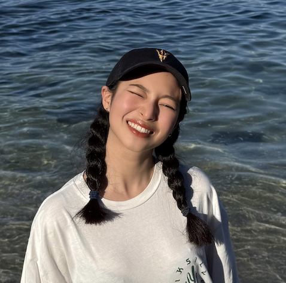

# 大頭照使用說明

## 📸 如何添加您的大頭照

### 1. 準備照片
- **建議尺寸**：300x300px 或更高解析度
- **格式**：JPG、PNG、WebP
- **建議**：使用正方形照片，確保臉部清晰可見

### 2. 添加照片
將您的大頭照命名為 `profile-photo.jpg` 並放置在與 `index.html` 相同的資料夾中。

**檔案結構**：
```
專案/
├── index.html
├── styles.css
├── script.js
├── profile-photo.jpg  ← 您的大頭照
└── README.md
```

### 3. 照片顯示效果

**有照片時**：
- 顯示您的實際照片
- 圓形裁剪效果
- 白色邊框裝飾

**無照片時**：
- 顯示預設的用戶圖標
- 保持相同的視覺效果

### 4. 自訂照片路徑

如果您想使用不同的檔案名稱或路徑，請修改 `index.html` 中的這一行：

```html

```

將 `profile-photo.jpg` 改為您的照片檔案名稱。

### 5. 照片優化建議

**最佳實踐**：
- 使用高品質但檔案大小適中的照片
- 確保照片光線充足，臉部清晰
- 建議使用專業拍攝的照片
- 避免過度修圖，保持自然

**技術規格**：
- 最小尺寸：200x200px
- 最大檔案大小：2MB
- 支援格式：JPG、PNG、WebP

### 6. 響應式設計

照片會在不同設備上自動調整：
- **桌面版**：120x120px
- **手機版**：100x100px
- 保持圓形和比例

### 7. 故障排除

**照片不顯示**：
1. 檢查檔案名稱是否正確
2. 確認檔案路徑是否正確
3. 檢查檔案格式是否支援
4. 確認檔案沒有損壞

**照片顯示異常**：
1. 檢查照片是否為正方形
2. 確認照片解析度是否足夠
3. 檢查瀏覽器是否支援該格式

---

**提示**：如果您暫時沒有合適的照片，系統會自動顯示預設的用戶圖標，不會影響網頁的正常運作。
